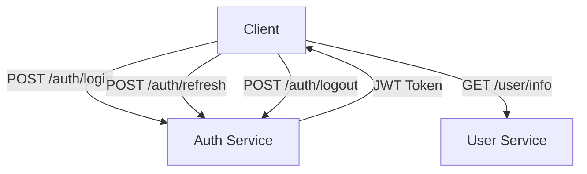
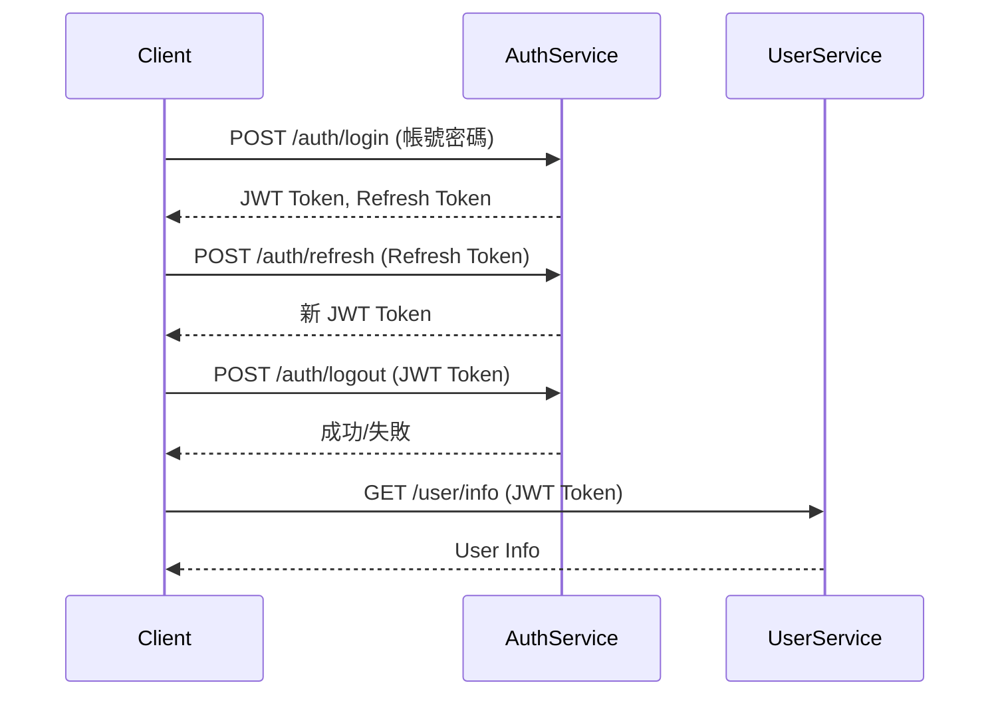
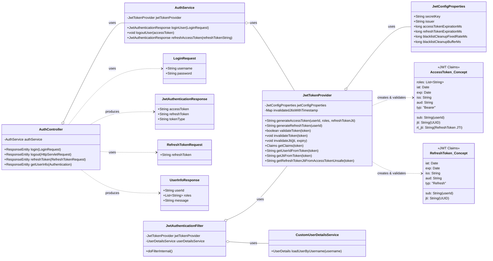

# JWT Authentication Microservice - Spec

## 技術選型

*   **Backend**: Spring Boot 3.3.0, JDK 21
*   **Build Tool**: Maven
*   **Language**: Java
*   **Library**: Lombok, Spring Web, Spring Security
*   **API**: RESTful API
*   **Authentication**: JWT (包含 UserID, Roles, Refresh Token, Issued Time, Expiry Time, Token ID)
    *   **建議欄位**: Issuer (iss), Audience (aud), Token Type (typ)
*   **安全性建議**: HTTPS, JWT 加密簽章

## API 規劃

### Mermaid 流程圖

### API Endpoints

*   `POST /auth/login`: 使用者登入
*   `POST /auth/refresh`: 使用者刷新 Token
*   `POST /auth/logout`: 使用者登出 (將 Token 標記為失效)
*   `GET /user/info`: 獲取使用者資訊

### JWT Claims

| 欄位名稱     | 說明                                                                                                                                                           |
| ------------ | -------------------------------------------------------------------------------------------------------------------------------------------------------------- |
| sub          | 使用者ID                                                                                                                                                       |
| roles        | 使用者權限                                                                                                                                                     |
| refreshToken | 對應的 Refresh Token (此欄位通常不直接放在 Access Token 中，而是 Refresh Token 本身，或是 Access Token 中有一個指向 Refresh Token 的ID。這裡先照原樣放，後續實作時澄清) |
| iat          | 發行時間                                                                                                                                                       |
| exp          | 過期時間                                                                                                                                                       |
| jti          | Token ID (唯一性標識)                                                                                                                                          |
| iss          | 發行者                                                                                                                                                         |
| aud          | 使用對象                                                                                                                                                       |
| typ          | Token 類型 (例如: 'Bearer')                                                                                                                                    |

## 主要流程圖 (循序圖)

## 物件關聯圖

## 安全性設計

*   JWT 使用 HMAC (例如 HS256 或 HS512) 或 RSA 簽章。 (預計先使用 HMAC)
*   HTTPS 保護傳輸層 (部署階段考量)。
*   Token 失效處理 (基於 jti 的已失效 Token 記錄機制)。
*   Refresh Token 與 Access Token 具備不同的過期時間。
*   透過 jti 防止重放攻擊。
